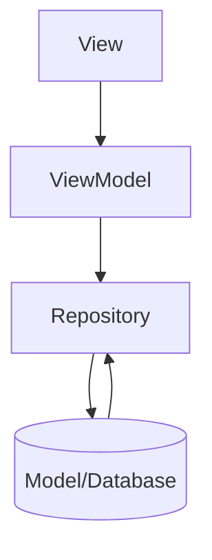

# Shoppinglist

Bei diesem Projekt geht es um die Erstellung einer Einkaufslist mit Jetpack Room unter Anwendung des MVVM.

Basis für dieses Projekt ist meine alte
[Shoppinglist](https://github.com/SoftdeveloperNeumann/ShoppingList230413)
, die hier modernisiert wurde.

## Das MVVM

MVVM steht für Model-View-ViewModel und ist ein Designmuster zur Strukturierung von Code in der Softwareentwicklung. Das Ziel von MVVM ist es, die Trennung von Geschäftslogik und Benutzeroberfläche zu verbessern und die Wiederverwendbarkeit von Code zu erhöhen.

Das **M** steht für Model, welches die Daten und die Logik enthält, um auf diese Daten zuzugreifen und sie zu ändern. Das **V** steht für View, was die Benutzeroberfläche darstellt. Das **VM** steht für ViewModel, welches eine Abstraktionsschicht zwischen Model und View darstellt. Es bereitet die Daten des Models so auf, dass sie von der View angezeigt werden können, und reagiert auf Benutzerinteraktionen, indem es die erforderlichen Änderungen am Model vornimmt.

Durch die Trennung von Model und View wird es einfacher, Änderungen an einer Schicht vorzunehmen, ohne dass andere Schichten davon betroffen sind. Außerdem können ViewModel-Instanzen getestet werden, ohne auf die Benutzeroberfläche angewiesen zu sein. Das MVVM-Muster wird häufig bei der Entwicklung von plattformübergreifenden Anwendungen, insbesondere bei der Entwicklung von mobilen Apps, verwendet.

Das Repository ist ein wichtiger Bestandteil des MVVM-Musters, da es eine Abstraktionsschicht zwischen der Datenquelle und der ViewModel-Schicht bildet. Es wird verwendet, um Daten von verschiedenen Datenquellen wie z. B. einer API oder einer lokalen Datenbank zu sammeln und dem ViewModel bereitzustellen.

Das Repository ist für die Verarbeitung von Daten verantwortlich, die von der ViewModel-Schicht benötigt werden, um die Benutzeroberfläche der App zu aktualisieren. Es übernimmt auch die Aufgabe, die Datenquelle zu kapseln und den Zugriff darauf zu verwalten, was dazu beiträgt, den Code sauberer und leichter testbar zu machen.

Das Repository fungiert als Single Point of Truth für die Daten, die von der App verwendet werden. Es ist dafür verantwortlich, die Daten zu cachen, zu aktualisieren und zu löschen, wenn nötig. Das ermöglicht es, den Zustand der App konsistent zu halten und das Risiko von Fehlern aufgrund inkonsistenter Daten zu minimieren.

Zusammenfassend lässt sich sagen, dass das Repository im MVVM-Muster dazu beiträgt, die ViewModel-Schicht von der Datenquelle zu entkoppeln und eine saubere, konsistente und testbare Datenverarbeitung zu ermöglichen.

### Schaubild MVVM:

 Die Pfeile zwischen den Boxen zeigen die Beziehungen zwischen den Komponenten: Die View kennt das ViewModel, das ViewModel kennt das Repository, und das Repository kennt das Datenmodell und greift darauf zu.

## Jetpack Room

Jetpack Room ist eine Abstraktionsebene über SQLite, die von Google entwickelt wurde und Bestandteil des Android Jetpack-Komponentensystems ist. Sie bietet ein ORM-Framework (Object-Relational Mapping), das es Entwicklern ermöglicht, Datenbanken in ihrer Android-App zu verwenden, ohne sich um den Low-Level-Code kümmern zu müssen, der normalerweise mit der Verwendung von SQLite verbunden ist.

Mit Room können Entwickler Datenbankanfragen auf einer höheren Abstraktionsebene ausführen, indem sie Datenbank-Entitäten als Java-Klassen definieren und die Datenbank-Operationen mit einer objektorientierten Syntax durchführen. Room bietet auch integrierte Unterstützung für LiveData und Kotlin Coroutines, um asynchrone Datenbankzugriffe zu vereinfachen und zu strukturieren.

Durch die Verwendung von Room in einer Android-App können Entwickler eine robuste und effiziente Datenbank-Integration implementieren, die einfach zu warten und zu erweitern ist. Room ermöglicht auch eine saubere Trennung von Daten und Geschäftslogik, was zu einer besseren Codequalität und einem einfacheren Testen führt.

Jetpack Room besteht aus drei Hauptkomponenten:

1. **Entity**: Dies definiert die Tabellen in der Datenbank und die Felder der Tabelle. Eine Entity-Klasse ist eine reine Kotlin / Java-Klasse, die mit der Annotation `@Entity` gekennzeichnet ist. Jede Instanz der Entity-Klasse stellt eine Zeile in der Datenbanktabelle dar.

2. **DAO**: DAO steht für "Data Access Object". Es stellt die Methoden bereit, um auf die Datenbank zuzugreifen. DAOs werden mit der Annotation `@Dao` gekennzeichnet. Jede DAO-Methode definiert eine SQL-Abfrage oder einen Datenbankzugriff. Die SQL-Abfragen werden normalerweise als Annotationen definiert, die die Methode kennzeichnen.

3. **Database**: Dies ist die eigentliche Datenbank. Sie enthält eine Liste aller Entitäten und eine Liste aller DAOs. Eine Database-Klasse ist eine abstrakte Klasse, die die RoomDatabase-Basisklasse erweitert und mit der Annotation `@Database` gekennzeichnet ist. Sie definiert die Entitäten und die Version der Datenbank. Außerdem gibt es hier Methoden, um DAOs zurückzugeben und Migrationen durchzuführen.